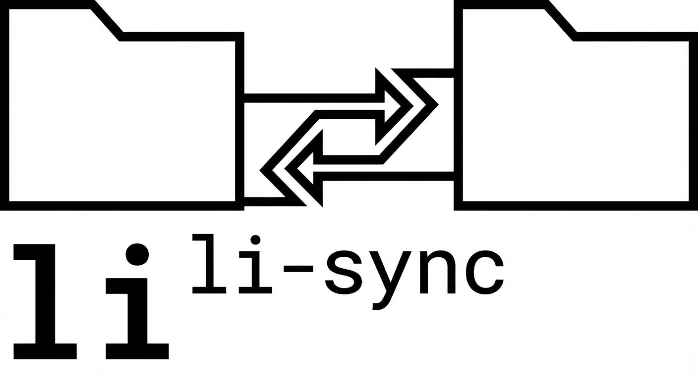

An interactive Dropbox-like bidirectional sync tool over SSH for devs.

## Current status
- Local scanner with support for:
  - nested `.dropboxignore`
  - excluded folders (`node_modules`, `.tox`, cache dirs)
- Remote scanner over SSH helper (streamed JSONL) with nested `.dropboxignore` + excluded folders.
- Local and remote scan status are persisted in SQLite under each sync root:
  - `<local_root>/.li-sync/state.sqlite3`
  - `<remote_root>/.li-sync/state.sqlite3`
- First comparison report that separates:
  - content status
  - metadata status (mode + mtime)
- scan progress with adaptive path depth for long-running scans
- Always excludes `.DS_Store`, excluded folder families, and `.li-sync`.
- Also excludes `.venv` and Finder `Icon\\r` marker files.
- Interactive review TUI with:
  - tree navigation
  - per-file/per-folder action assignment
  - in-TUI plan apply with confirmation + progress + errors

## Install dependencies

```bash
uv sync
```

## Run

```bash
uv run li-sync --help
uv run li-sync scan
uv run li-sync review
```

### Useful scan overrides

```bash
uv run li-sync scan \
  --local-root /Users/dario.varotto/Dropbox \
  --remote-user dario \
  --remote-host 192.168.18.18 \
  --remote-root '~/Dropbox'

# Scan without opening the review UI immediately
uv run li-sync scan --no-open-review

# Review from local SQLite state
uv run li-sync review \
  --local-root /Users/dario.varotto/Dropbox
```

## Review UI keys
- Arrow keys: navigate tree
- Enter: open/close selected folder
- `h`: show/hide completely identical folders (preference persisted in SQLite)
- `l`: left wins (applies to selected file/subtree)
- `r`: right wins (applies to selected file/subtree)
- `i`: ignore (applies to selected file/subtree)
- `s`: suggested planner action (applies to selected file/subtree)
- `a`: apply current plan (press twice to confirm)
- `q`: quit

## Planner behavior
- Default action is `ignore` (do nothing) until you assign actions.
- Plan summary shows operation counts:
  - delete left/right
  - copy left/right
  - metadata updates left/right
- `a` is disabled when total planned operations is zero.
- Applying opens:
  - confirmation modal (`A` apply / `C` cancel)
  - execution modal with progress bar and error list
- After apply:
  - successful paths are marked done in-place during execution (no rescan)
  - failed paths stay pending in the UI

## Notes
- There is no standalone CLI `apply` command; apply is executed from the review TUI.
- xattr-based exclusion is intentionally disabled in current scan path for performance.
